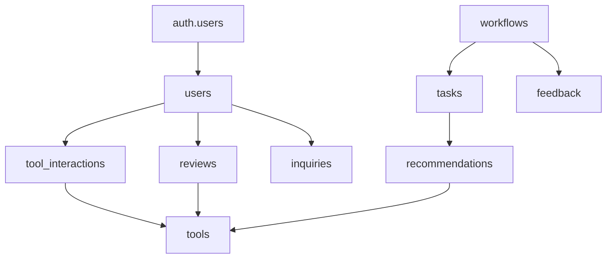

# FlowGenius - AI 워크플로우 디자이너 시스템 분석 문서

## 개요

이 문서는 FlowGenius AI 워크플로우 디자이너 프로젝트의 전체 시스템 구조, 데이터베이스 설계, 그리고 주요 기능의 처리 흐름에 대한 종합적인 분석을 제공합니다.

## 목차

1. [시스템 아키텍처 개요](#1-시스템-아키텍처-개요)
2. [프로젝트 구조](#2-프로젝트-구조)
3. [데이터베이스 구조 분석](#3-데이터베이스-구조-분석)
4. [주요 기능 처리 흐름](#4-주요-기능-처리-흐름)
5. [성능 최적화 요소](#5-성능-최적화-요소)
6. [보안 및 인프라](#6-보안-및-인프라)

---

## 1. 시스템 아키텍처 개요

### 1.1 전체 아키텍처

FlowGenius는 **풀스택 AI 웹 애플리케이션**으로, 사용자가 목표를 입력하면 AI가 작업을 분해하고 적절한 도구를 추천하는 워크플로우 디자이너입니다.

#### 기술 스택

- **프론트엔드**: Next.js 15.1.0 (App Router) + React 19.0.0 + TypeScript
- **백엔드**: Next.js API Routes (서버리스 함수)
- **데이터베이스**: Supabase (PostgreSQL + pgvector)
- **AI/ML**: Google Gemini 2.5-pro + LangChain
- **상태관리**: Zustand + React Query + React Context
- **스타일링**: Tailwind CSS + shadcn/ui

#### 아키텍처 패턴

```
┌─────────────────┐    ┌─────────────────┐    ┌─────────────────┐
│   Client Side   │    │   Server Side   │    │   Database &    │
│                 │    │                 │    │   AI Services   │
├─────────────────┤    ├─────────────────┤    ├─────────────────┤
│ • Next.js App   │◄──►│ • API Routes    │◄──►│ • Supabase      │
│ • React 19      │    │ • LangChain     │    │ • Google AI     │
│ • Zustand       │    │ • Vector Search │    │ • pgvector      │
│ • Tailwind CSS  │    │ • Streaming API │    │ • Auth System   │
└─────────────────┘    └─────────────────┘    └─────────────────┘
```

### 1.2 핵심 기능 개요

1. **워크플로우 생성**: AI 기반 작업 분해 및 도구 추천
2. **벡터 검색**: 하이브리드 검색 (벡터 + 텍스트 유사도)
3. **실시간 처리**: 스트리밍 API를 통한 진행상황 표시
4. **사용자 피드백**: 도구 평가 및 워크플로우 피드백
5. **인증 시스템**: Supabase Auth + Google OAuth

---

## 2. 프로젝트 구조

### 2.1 디렉토리 구조

```
C:\Users\parks\Projects\workflow-ai\
├── src/
│   ├── app/                    # Next.js App Router
│   │   ├── api/               # API 라우트 (백엔드)
│   │   │   ├── workflow/      # 워크플로우 생성 API
│   │   │   │   ├── route.ts   # 동기식 워크플로우 API
│   │   │   │   └── stream/    # 스트리밍 워크플로우 API
│   │   │   ├── tools/         # 도구 상호작용 API
│   │   │   ├── feedback/      # 피드백 API
│   │   │   └── system/        # 시스템 관리 API
│   │   ├── auth/             # 인증 관련 페이지
│   │   ├── contact/          # 문의 페이지
│   │   ├── pricing/          # 가격 페이지
│   │   └── tools/            # 도구 목록 페이지
│   ├── components/            # UI 컴포넌트
│   │   └── ui/               # shadcn/ui 기반 재사용 컴포넌트
│   ├── contexts/             # React Context (전역 상태)
│   ├── features/             # 기능별 모듈
│   │   └── workflow/         # 워크플로우 관련 컴포넌트/훅
│   ├── hooks/                # 커스텀 React 훅
│   ├── lib/                  # 유틸리티 및 서비스
│   │   ├── cache/            # 메모리 캐싱
│   │   ├── config/           # 환경 설정
│   │   ├── langchain/        # LangChain 체인 정의
│   │   ├── middleware/       # API 미들웨어
│   │   ├── services/         # 비즈니스 로직
│   │   └── supabase/         # 데이터베이스 클라이언트
│   └── types/                # TypeScript 타입 정의
├── supabase/                 # 데이터베이스 마이그레이션
│   ├── migrations/           # SQL 마이그레이션 파일
│   └── config.toml          # Supabase 설정
└── public/                   # 정적 파일
```

### 2.2 주요 컴포넌트 구조

```typescript
// 컴포넌트 계층
Navigation (네비게이션)
└── WorkflowInputForm (목표 입력)
    └── WorkflowResultDisplay (결과 표시)
        └── TaskCard[] (작업 카드들)
            └── ToolInteractionButtons (도구 상호작용)
```

### 2.3 주요 라이브러리 의존성

#### AI/ML 관련

```json
{
  "langchain": "^0.3.30", // AI 체인 관리
  "@langchain/google-genai": "^0.2.16", // Google AI 통합
  "@langchain/community": "^0.3.49", // 벡터스토어 등
  "franc": "^6.2.0" // 언어 감지
}
```

#### 상태 관리 및 데이터 페칭

```json
{
  "zustand": "^4", // 전역 상태 관리
  "@tanstack/react-query": "^5", // 서버 상태 관리
  "react-hook-form": "^7", // 폼 관리
  "zod": "^3" // 스키마 유효성 검사
}
```

#### UI/UX

```json
{
  "@radix-ui/*": "^1.x.x", // 접근성 중심 UI 컴포넌트
  "tailwindcss": "^3.4.1", // CSS 프레임워크
  "framer-motion": "^11", // 애니메이션
  "lucide-react": "^0.469.0", // 아이콘
  "next-themes": "^0.4.3" // 다크모드 지원
}
```

---

## 3. 데이터베이스 구조 분석

### 3.1 확장(Extensions) 및 타입

- 확장: `vector`(pgvector), `pg_trgm`
- 사용자 정의 타입: `inquiry_type` ENUM ('general', 'partnership', 'support', 'feedback')

```sql
-- 확장
CREATE EXTENSION IF NOT EXISTS vector;
CREATE EXTENSION IF NOT EXISTS pg_trgm;

-- 문의 유형 ENUM
CREATE TYPE inquiry_type AS ENUM ('general', 'partnership', 'support', 'feedback');
```

### 3.2 테이블 스키마

#### 3.2.1 workflows

```sql
CREATE TABLE IF NOT EXISTS workflows (
  id UUID PRIMARY KEY DEFAULT gen_random_uuid(),
  created_at TIMESTAMPTZ DEFAULT now(),
  goal TEXT NOT NULL CHECK (length(goal) >= 10 AND length(goal) <= 200),
  language TEXT NOT NULL DEFAULT 'ko',
  status TEXT NOT NULL DEFAULT 'processing' CHECK (status IN ('processing', 'completed', 'failed')),
  metadata JSONB DEFAULT '{}'
);
```

#### 3.2.2 tasks

```sql
CREATE TABLE IF NOT EXISTS tasks (
  id UUID PRIMARY KEY DEFAULT gen_random_uuid(),
  workflow_id UUID NOT NULL REFERENCES workflows(id) ON DELETE CASCADE,
  created_at TIMESTAMPTZ DEFAULT now(),
  order_index INTEGER NOT NULL CHECK (order_index >= 1 AND order_index <= 5),
  name TEXT NOT NULL,
  description TEXT,
  UNIQUE(workflow_id, order_index)
);
```

#### 3.2.3 tools

```sql
CREATE TABLE IF NOT EXISTS tools (
  id UUID PRIMARY KEY DEFAULT gen_random_uuid(),
  created_at TIMESTAMPTZ DEFAULT now(),
  updated_at TIMESTAMPTZ DEFAULT now(),
  name TEXT NOT NULL UNIQUE,
  description TEXT,
  url TEXT,
  logo_url TEXT,
  categories TEXT[] DEFAULT '{}',
  pros TEXT[] DEFAULT '{}',
  cons TEXT[] DEFAULT '{}',
  embedding_text TEXT,
  recommendation_tip TEXT,
  embedding VECTOR(768),
  is_active BOOLEAN DEFAULT true
);
```

#### 3.2.4 recommendations

```sql
CREATE TABLE IF NOT EXISTS recommendations (
  id UUID PRIMARY KEY DEFAULT gen_random_uuid(),
  task_id UUID NOT NULL REFERENCES tasks(id) ON DELETE CASCADE,
  tool_id UUID REFERENCES tools(id) ON DELETE SET NULL,
  created_at TIMESTAMPTZ DEFAULT now(),
  reason TEXT NOT NULL,
  confidence_score FLOAT CHECK (confidence_score >= 0 AND confidence_score <= 1),
  alternatives JSONB DEFAULT '[]',
  UNIQUE(task_id)
);
```

#### 3.2.5 feedback

```sql
CREATE TABLE IF NOT EXISTS feedback (
  id UUID PRIMARY KEY DEFAULT gen_random_uuid(),
  workflow_id UUID NOT NULL REFERENCES workflows(id) ON DELETE CASCADE,
  created_at TIMESTAMPTZ DEFAULT now(),
  rating INTEGER NOT NULL CHECK (rating >= 1 AND rating <= 5),
  comment TEXT,
  metadata JSONB DEFAULT '{}',
  UNIQUE(workflow_id)
);
```

#### 3.2.6 users / tool_interactions / reviews

```sql
-- public.users (auth.users와 1:1, 공개 프로필)
CREATE TABLE IF NOT EXISTS users (
  id UUID PRIMARY KEY REFERENCES auth.users(id) ON DELETE CASCADE,
  full_name TEXT,
  avatar_url TEXT,
  created_at TIMESTAMPTZ DEFAULT now(),
  updated_at TIMESTAMPTZ DEFAULT now()
);

-- 도구 좋아요/싫어요
CREATE TABLE IF NOT EXISTS tool_interactions (
  id BIGINT PRIMARY KEY GENERATED ALWAYS AS IDENTITY,
  user_id UUID NOT NULL REFERENCES users(id) ON DELETE CASCADE,
  tool_id UUID NOT NULL REFERENCES tools(id) ON DELETE CASCADE,
  interaction_type SMALLINT NOT NULL CHECK (interaction_type IN (-1, 1)),
  created_at TIMESTAMPTZ DEFAULT now(),
  updated_at TIMESTAMPTZ DEFAULT now(),
  UNIQUE (user_id, tool_id)
);

-- 도구 리뷰
CREATE TABLE IF NOT EXISTS reviews (
  id BIGINT PRIMARY KEY GENERATED ALWAYS AS IDENTITY,
  user_id UUID NOT NULL REFERENCES users(id) ON DELETE CASCADE,
  tool_id UUID NOT NULL REFERENCES tools(id) ON DELETE CASCADE,
  content TEXT NOT NULL CHECK (char_length(content) >= 10 AND char_length(content) <= 1000),
  created_at TIMESTAMPTZ DEFAULT now(),
  updated_at TIMESTAMPTZ DEFAULT now()
);
```

#### 3.2.7 inquiries

```sql
CREATE TABLE IF NOT EXISTS inquiries (
  id BIGINT PRIMARY KEY GENERATED ALWAYS AS IDENTITY,
  inquiry_type inquiry_type NOT NULL DEFAULT 'general',
  email TEXT NOT NULL CHECK (email ~* '^[A-Za-z0-9._%+-]+@[A-Za-z0-9.-]+\.[A-Za-z]{2,}$'),
  message TEXT NOT NULL CHECK (char_length(message) >= 10 AND char_length(message) <= 2000),
  user_id UUID REFERENCES users(id) ON DELETE SET NULL,
  created_at TIMESTAMPTZ DEFAULT now(),
  updated_at TIMESTAMPTZ DEFAULT now()
);
```

### 3.3 함수/트리거/뷰

```sql
-- updated_at 자동 갱신
CREATE OR REPLACE FUNCTION update_updated_at_column()
RETURNS TRIGGER AS $$
BEGIN
  NEW.updated_at = now();
  RETURN NEW;
END;
$$ LANGUAGE plpgsql;

-- tools.updated_at 트리거
CREATE TRIGGER update_tools_updated_at
  BEFORE UPDATE ON tools
  FOR EACH ROW
  EXECUTE FUNCTION update_updated_at_column();

-- 워크플로우 상태 자동 업데이트 (추천 생성/삭제 시)
CREATE OR REPLACE FUNCTION update_workflow_status()
RETURNS TRIGGER AS $$
DECLARE
  total_tasks INTEGER;
  completed_recommendations INTEGER;
  target_workflow_id UUID;
BEGIN
  IF TG_OP = 'DELETE' THEN
    SELECT workflow_id INTO target_workflow_id FROM tasks WHERE id = OLD.task_id;
  ELSE
    SELECT workflow_id INTO target_workflow_id FROM tasks WHERE id = NEW.task_id;
  END IF;

  SELECT COUNT(*) INTO total_tasks FROM tasks WHERE workflow_id = target_workflow_id;
  SELECT COUNT(*) INTO completed_recommendations
  FROM recommendations r
  JOIN tasks t ON r.task_id = t.id
  WHERE t.workflow_id = target_workflow_id;

  IF total_tasks = completed_recommendations THEN
    UPDATE workflows SET status = 'completed' WHERE id = target_workflow_id;
  END IF;

  RETURN COALESCE(NEW, OLD);
END;
$$ LANGUAGE plpgsql;

CREATE TRIGGER trigger_update_workflow_status
  AFTER INSERT OR DELETE ON recommendations
  FOR EACH ROW
  EXECUTE FUNCTION update_workflow_status();

-- 신규 auth.users 생성 시 public.users 자동 생성
CREATE OR REPLACE FUNCTION handle_new_user()
RETURNS TRIGGER AS $$
BEGIN
  INSERT INTO public.users (id, full_name, avatar_url)
  VALUES (
    NEW.id,
    NEW.raw_user_meta_data->>'full_name',
    NEW.raw_user_meta_data->>'avatar_url'
  );
  RETURN NEW;
END;
$$ LANGUAGE plpgsql SECURITY DEFINER;

CREATE TRIGGER on_auth_user_created
  AFTER INSERT ON auth.users
  FOR EACH ROW EXECUTE FUNCTION handle_new_user();

-- 활성화된 임베딩 도구 MV
CREATE MATERIALIZED VIEW IF NOT EXISTS active_tools_with_embeddings AS
SELECT id, name, description, url, logo_url, categories, embedding, created_at, updated_at
FROM tools
WHERE is_active = true AND embedding IS NOT NULL;

-- MV 리프레시 함수
CREATE OR REPLACE FUNCTION refresh_active_tools_view()
RETURNS void
LANGUAGE plpgsql AS $$
BEGIN
  REFRESH MATERIALIZED VIEW CONCURRENTLY active_tools_with_embeddings;
  ANALYZE active_tools_with_embeddings;
END;
$$;

-- 인덱스 사용 모니터링
CREATE OR REPLACE FUNCTION check_vector_index_performance()
RETURNS TABLE (
  index_name text,
  schemaname text,
  relname text,
  idx_scan bigint,
  idx_tup_read bigint,
  idx_tup_fetch bigint
) LANGUAGE sql AS $$
  SELECT indexrelname::text, schemaname, relname, idx_scan, idx_tup_read, idx_tup_fetch
  FROM pg_stat_user_indexes
  WHERE relname IN ('tools', 'active_tools_with_embeddings')
    AND indexrelname LIKE '%embedding%'
  ORDER BY idx_scan DESC;
$$;
```

### 3.4 검색 함수 (벡터/하이브리드)

#### match_tools (LangChain 호환 반환 형태)

```sql
CREATE OR REPLACE FUNCTION match_tools(
  query_embedding vector(768),
  match_count int DEFAULT 3,
  filter jsonb DEFAULT '{}'
)
RETURNS TABLE (
  id uuid,
  content text,
  metadata jsonb,
  similarity float
)
LANGUAGE plpgsql AS $$
BEGIN
  RETURN QUERY
  SELECT
    tools.id,
    tools.embedding_text as content,
    jsonb_build_object(
      'id', tools.id,
      'name', tools.name,
      'description', tools.description,
      'url', tools.url,
      'logo_url', tools.logo_url,
      'categories', tools.categories,
      'pros', tools.pros,
      'cons', tools.cons,
      'recommendation_tip', tools.recommendation_tip
    ) as metadata,
    1 - (tools.embedding <=> query_embedding) AS similarity
  FROM tools
  WHERE tools.is_active = true
    AND tools.embedding IS NOT NULL
    AND (filter = '{}' OR jsonb_build_object(
      'id', tools.id,
      'name', tools.name,
      'description', tools.description,
      'url', tools.url,
      'logo_url', tools.logo_url,
      'categories', tools.categories,
      'pros', tools.pros,
      'cons', tools.cons,
      'recommendation_tip', tools.recommendation_tip
    ) @> filter)
  ORDER BY tools.embedding <=> query_embedding ASC
  LIMIT match_count;
END;
$$;
```

#### hybrid_search_tools (텍스트+벡터 결합)

```sql
CREATE OR REPLACE FUNCTION hybrid_search_tools(
  query_text TEXT,
  query_embedding TEXT,
  match_count INTEGER DEFAULT 3,
  vector_weight NUMERIC DEFAULT 0.7,
  text_weight NUMERIC DEFAULT 0.3
)
RETURNS TABLE (
  id UUID,
  name TEXT,
  description TEXT,
  url TEXT,
  logo_url TEXT,
  categories TEXT[],
  is_active BOOLEAN,
  hybrid_score DOUBLE PRECISION,
  vector_similarity DOUBLE PRECISION,
  text_similarity DOUBLE PRECISION
)
LANGUAGE plpgsql AS $$
DECLARE
  query_embedding_vector vector(768);
BEGIN
  query_embedding_vector := query_embedding::vector;

  RETURN QUERY
  WITH vector_search AS (
    SELECT t.id, t.name, t.description, t.url, t.logo_url, t.categories, t.is_active,
           (1 - (t.embedding <=> query_embedding_vector))::DOUBLE PRECISION AS vector_sim
    FROM tools t
    WHERE t.is_active = true AND t.embedding IS NOT NULL
    ORDER BY t.embedding <=> query_embedding_vector
    LIMIT match_count * 2
  ),
  text_search AS (
    SELECT t.id, t.name, t.description, t.url, t.logo_url, t.categories, t.is_active,
           GREATEST(
             similarity(t.name, query_text),
             similarity(t.description, query_text),
             COALESCE(similarity(array_to_string(t.categories, ' '), query_text), 0)
           ) AS text_sim
    FROM tools t
    WHERE t.is_active = true AND (
      t.name ILIKE '%' || query_text || '%'
      OR t.description ILIKE '%' || query_text || '%'
      OR EXISTS (
        SELECT 1 FROM unnest(t.categories) AS category WHERE category ILIKE '%' || query_text || '%'
      )
    )
    ORDER BY text_sim DESC
    LIMIT match_count * 2
  ),
  combined_results AS (
    SELECT
      COALESCE(v.id, t.id) AS id,
      COALESCE(v.name, t.name) AS name,
      COALESCE(v.description, t.description) AS description,
      COALESCE(v.url, t.url) AS url,
      COALESCE(v.logo_url, t.logo_url) AS logo_url,
      COALESCE(v.categories, t.categories) AS categories,
      COALESCE(v.is_active, t.is_active) AS is_active,
      COALESCE(v.vector_sim, 0::DOUBLE PRECISION) AS vector_sim,
      COALESCE(t.text_sim, 0::DOUBLE PRECISION) AS text_sim
    FROM vector_search v
    FULL OUTER JOIN text_search t ON v.id = t.id
  )
  SELECT
    cr.id, cr.name, cr.description, cr.url, cr.logo_url, cr.categories, cr.is_active,
    (cr.vector_sim * vector_weight::DOUBLE PRECISION + cr.text_sim * text_weight::DOUBLE PRECISION) AS hybrid_score,
    cr.vector_sim AS vector_similarity,
    cr.text_sim AS text_similarity
  FROM combined_results cr
  WHERE cr.is_active = true
  ORDER BY hybrid_score DESC
  LIMIT match_count;
END;
$$;

-- 텍스트 유사도 인덱스 (trigram)
CREATE INDEX IF NOT EXISTS idx_tools_name_gin ON tools USING gin(name gin_trgm_ops);
CREATE INDEX IF NOT EXISTS idx_tools_description_gin ON tools USING gin(description gin_trgm_ops);
```

### 3.5 인덱스/최적화

```sql
-- workflows
CREATE INDEX IF NOT EXISTS idx_workflows_created_at ON workflows(created_at DESC);
CREATE INDEX IF NOT EXISTS idx_workflows_language ON workflows(language);
CREATE INDEX IF NOT EXISTS idx_workflows_status ON workflows(status);

-- tasks
CREATE INDEX IF NOT EXISTS idx_tasks_workflow_id ON tasks(workflow_id);
CREATE INDEX IF NOT EXISTS idx_tasks_order ON tasks(workflow_id, order_index);

-- tools (벡터, 카테고리, 활성화 상태)
CREATE INDEX IF NOT EXISTS idx_tools_name ON tools(name);
CREATE INDEX IF NOT EXISTS idx_tools_categories ON tools USING GIN(categories);
CREATE INDEX IF NOT EXISTS idx_tools_active ON tools(is_active) WHERE is_active = true;
DROP INDEX IF EXISTS idx_tools_embedding; -- 구 인덱스 제거
DROP INDEX IF EXISTS idx_tools_embedding_optimized; -- 재생성 전 정리
CREATE INDEX idx_tools_embedding_optimized ON tools USING ivfflat (embedding vector_cosine_ops) WITH (lists = 10);
CREATE INDEX IF NOT EXISTS idx_tools_active_with_embedding ON tools(is_active) WHERE is_active = true AND embedding IS NOT NULL;

-- recommendations
CREATE INDEX IF NOT EXISTS idx_recommendations_task_id ON recommendations(task_id);
CREATE INDEX IF NOT EXISTS idx_recommendations_tool_id ON recommendations(tool_id);
CREATE INDEX IF NOT EXISTS idx_recommendations_confidence ON recommendations(confidence_score DESC);

-- feedback
CREATE INDEX IF NOT EXISTS idx_feedback_workflow_id ON feedback(workflow_id);
CREATE INDEX IF NOT EXISTS idx_feedback_rating ON feedback(rating);
CREATE INDEX IF NOT EXISTS idx_feedback_created_at ON feedback(created_at DESC);

-- MV 인덱스
CREATE INDEX IF NOT EXISTS idx_active_tools_embedding ON active_tools_with_embeddings USING ivfflat (embedding vector_cosine_ops) WITH (lists = 5);
```

### 3.6 MVP 추천 확장 (최소 변경)

```sql
-- tools 최소 확장
ALTER TABLE tools
ADD COLUMN IF NOT EXISTS bench_score NUMERIC,
ADD COLUMN IF NOT EXISTS domains TEXT[] DEFAULT '{}',
ADD COLUMN IF NOT EXISTS cost_index NUMERIC;

-- 간단 정책 테이블
CREATE TABLE IF NOT EXISTS recommendation_policy (
  id UUID PRIMARY KEY DEFAULT gen_random_uuid(),
  name TEXT NOT NULL UNIQUE,
  weights JSONB NOT NULL, -- {"bench":0.6, "domain":0.3, "cost":0.1}
  created_at TIMESTAMPTZ DEFAULT now()
);

-- 기본 정책
INSERT INTO recommendation_policy (name, weights)
VALUES ('default_mvp', '{"bench":0.6, "domain":0.3, "cost":0.1}')
ON CONFLICT (name) DO NOTHING;
```

점수화: `score = bench*w_bench + domain*w_domain + cost*w_cost`. `domain`은 간단 매칭(0/1)부터 시작해도 됨.

### 3.7 Row Level Security (RLS)

```sql
-- RLS 활성화
ALTER TABLE workflows ENABLE ROW LEVEL SECURITY;
ALTER TABLE tasks ENABLE ROW LEVEL SECURITY;
ALTER TABLE tools ENABLE ROW LEVEL SECURITY;
ALTER TABLE recommendations ENABLE ROW LEVEL SECURITY;
ALTER TABLE feedback ENABLE ROW LEVEL SECURITY;
ALTER TABLE users ENABLE ROW LEVEL SECURITY;
ALTER TABLE tool_interactions ENABLE ROW LEVEL SECURITY;
ALTER TABLE reviews ENABLE ROW LEVEL SECURITY;
ALTER TABLE inquiries ENABLE ROW LEVEL SECURITY;

-- 정책 테이블 RLS (service_role 전용)
ALTER TABLE recommendation_policy ENABLE ROW LEVEL SECURITY;
CREATE POLICY IF NOT EXISTS "Service role read" ON recommendation_policy FOR SELECT USING (auth.role() = 'service_role');
CREATE POLICY IF NOT EXISTS "Service role write" ON recommendation_policy FOR INSERT WITH CHECK (auth.role() = 'service_role');

-- 공개 읽기 (MVP 범위)
CREATE POLICY IF NOT EXISTS "Public read access" ON workflows FOR SELECT USING (true);
CREATE POLICY IF NOT EXISTS "Public read access" ON tasks FOR SELECT USING (true);
CREATE POLICY IF NOT EXISTS "Public read access" ON tools FOR SELECT USING (true);
CREATE POLICY IF NOT EXISTS "Public read access" ON recommendations FOR SELECT USING (true);

-- service_role 전용 쓰기 (운영 배치/서버 사이드)
CREATE POLICY IF NOT EXISTS "Service role insert" ON workflows FOR INSERT WITH CHECK (auth.role() = 'service_role');
CREATE POLICY IF NOT EXISTS "Service role insert" ON tasks FOR INSERT WITH CHECK (auth.role() = 'service_role');
CREATE POLICY IF NOT EXISTS "Service role insert" ON recommendations FOR INSERT WITH CHECK (auth.role() = 'service_role');
CREATE POLICY IF NOT EXISTS "Service role insert" ON feedback FOR INSERT WITH CHECK (auth.role() = 'service_role');
CREATE POLICY IF NOT EXISTS "Admin only modify" ON tools FOR ALL USING (auth.role() = 'service_role');

-- 프로필/상호작용/리뷰
CREATE POLICY IF NOT EXISTS "Public profiles are viewable by everyone" ON users FOR SELECT USING (true);
CREATE POLICY IF NOT EXISTS "Users can insert their own profile" ON users FOR INSERT WITH CHECK (auth.uid() = id);
CREATE POLICY IF NOT EXISTS "Users can update their own profile" ON users FOR UPDATE USING (auth.uid() = id);

CREATE POLICY IF NOT EXISTS "Users can view all interactions" ON tool_interactions FOR SELECT USING (true);
CREATE POLICY IF NOT EXISTS "Users can manage their own interactions" ON tool_interactions FOR ALL USING (auth.uid() = user_id);

CREATE POLICY IF NOT EXISTS "Reviews are viewable by everyone" ON reviews FOR SELECT USING (true);
CREATE POLICY IF NOT EXISTS "Users can insert their own reviews" ON reviews FOR INSERT WITH CHECK (auth.uid() = user_id);
CREATE POLICY IF NOT EXISTS "Users can update their own reviews" ON reviews FOR UPDATE USING (auth.uid() = user_id);
CREATE POLICY IF NOT EXISTS "Users can delete their own reviews" ON reviews FOR DELETE USING (auth.uid() = user_id);

-- 문의(inquiries)
CREATE POLICY IF NOT EXISTS "Anyone can create inquiries" ON inquiries FOR INSERT WITH CHECK (true);
CREATE POLICY IF NOT EXISTS "Users can view their own inquiries" ON inquiries FOR SELECT USING (auth.uid() = user_id OR user_id IS NULL);
```

### 3.8 테이블 관계도



---

## 4. 주요 기능 처리 흐름

### 4.1 인증 시스템

#### 이중 인증 아키텍처

- **웹 사용자**: Supabase Auth (Google OAuth)
- **API 클라이언트**: API Key 기반 인증

#### 웹 사용자 인증 흐름

```
1. Client → AuthContext.signInWithGoogle()
   ├─ sessionStorage에 returnUrl 저장
   ├─ Supabase OAuth 요청
   └─ Google 인증 프로세스

2. Google → /auth/callback
   ├─ Supabase 세션 생성
   └─ returnUrl로 리다이렉트

3. AuthContext 상태 관리
   ├─ 초기 세션 확인
   ├─ 세션 상태 변경 감지
   └─ 전역 상태 업데이트

4. Middleware 보안 검증
   ├─ 모든 요청에서 세션 갱신
   ├─ 보호된 라우트 체크
   └─ 미인증 시 리다이렉트
```

### 4.2 워크플로우 생성 흐름

#### 동기식 API (`/api/workflow`)

```
1. 요청 검증 및 준비
   ├─ Rate limiting (10req/min)
   ├─ Authentication check
   ├─ Zod schema validation
   └─ Cache key 생성

2. 캐시 확인
   ├─ Hit: 캐시된 결과 반환
   └─ Miss: 워크플로우 처리 시작

3. 워크플로우 생성
   ├─ DB에 workflows 레코드 생성
   └─ status: "processing"

4. 작업 분해 (LangChain)
   ├─ createTaskDecomposerChain() 호출
   ├─ LLM을 통한 목표 분해
   └─ tasks 테이블에 저장

5. 병렬 도구 추천
   ├─ 각 작업별 벡터 검색
   ├─ LLM 기반 도구 추천
   └─ 신뢰도 점수 계산

6. 결과 저장 및 반환
   ├─ recommendations 배치 저장
   ├─ 워크플로우 상태 "completed"
   ├─ 결과 캐시 저장
   └─ WorkflowResponse 반환
```

#### 스트리밍 API (`/api/workflow/stream`)

```
1. 스트림 설정
   ├─ ManagedReadableStream 생성
   ├─ SSE 헤더 설정
   └─ 백그라운드 처리 시작

2. 실시간 진행상황 전송
   ├─ validation (10%): "입력 검증 완료"
   ├─ workflow_created (20%): "워크플로우 생성 완료"
   ├─ task_decomposition_start (25%): "작업 분해 시작"
   ├─ task_decomposition_complete (40%): "분해 완료"
   ├─ recommendations_start (55%): "도구 추천 시작"
   ├─ recommendations_complete (90%): "추천 완료"
   └─ complete (100%): 최종 결과

3. 에러 처리 및 리소스 관리
   ├─ 10분 타임아웃
   ├─ 클라이언트 연결 끊김 감지
   └─ 자동 리소스 정리
```

### 4.3 벡터 검색 흐름

#### 하이브리드 검색 프로세스

```
1. 검색 쿼리 전처리
   ├─ 언어 감지 (franc)
   ├─ 텍스트 정규화
   └─ 임베딩 생성 (Google text-embedding-004)

2. 다중 검색 전략
   ├─ 벡터 유사도 검색 (cosine similarity)
   ├─ 텍스트 유사도 검색 (trigram)
   └─ 카테고리 기반 필터링

3. 점수 통합
   ├─ 벡터 점수 (가중치 0.7)
   ├─ 텍스트 점수 (가중치 0.3)
   └─ 최종 combined_score 계산

4. Fallback 전략
   ├─ 하이브리드 검색 실패 시
   ├─ 벡터 검색만 실행
   └─ 최소 결과 보장
```

### 4.4 상태 관리 흐름

#### 클라이언트 상태 동기화

```
1. 사용자 액션
   └─ WorkflowInputForm → useWorkflowStream.startWorkflow()

2. 스트림 연결
   ├─ setStreamState({ isProcessing: true })
   └─ fetch('/api/workflow/stream')

3. 실시간 업데이트
   ├─ progress 이벤트 → progress 업데이트
   ├─ complete 이벤트 → result 설정
   └─ error 이벤트 → error 상태 설정

4. 상태 전파
   ├─ WorkflowResultDisplay 리렌더링
   └─ 사용자 인터페이스 업데이트
```

---

## 5. 성능 최적화 요소

### 5.1 서버 최적화

#### 병렬 처리

```typescript
// 작업별 도구 추천을 병렬로 처리
const recommendationPromises = tasks.map(async (task) => {
  const tools = await getRelevantTools(task.name);
  const recommendation = await recommendToolForTask(task, tools);
  return { task, recommendation };
});

const results = await Promise.all(recommendationPromises);
```

#### 메모리 캐싱

```typescript
// 작업 분해 결과 캐싱 (5분)
const tasksCacheKey = `tasks_${goalHash}_${language}`;
const cachedTasks = cache.get(tasksCacheKey);

// 도구 검색 결과 캐싱 (10분)
const toolsCacheKey = `tools_${searchQuery}`;
const cachedTools = cache.get(toolsCacheKey);
```

#### 데이터베이스 최적화

```sql
-- 배치 삽입으로 성능 향상
INSERT INTO recommendations (task_id, tool_id, reason, confidence_score)
VALUES
  ($1, $2, $3, $4),
  ($5, $6, $7, $8),
  ($9, $10, $11, $12);

-- 복합 인덱스로 조회 성능 향상
CREATE INDEX idx_active_tools_with_embedding
ON tools (is_active, embedding) WHERE embedding IS NOT NULL;
```

### 5.2 클라이언트 최적화

#### React Query 캐싱

```typescript
const { data: tools, isLoading } = useQuery({
  queryKey: ["tools"],
  queryFn: fetchTools,
  staleTime: 5 * 60 * 1000, // 5분 캐시
  cacheTime: 10 * 60 * 1000, // 10분 보관
});
```

#### 지연 로딩

```typescript
// 도구 상세 정보는 필요할 때만 로드
const ToolDetailModal = lazy(() => import("./ToolDetailModal"));
```

### 5.3 성능 모니터링

#### 구조화된 로깅

```typescript
// API 응답 시간 측정
const startTime = Date.now();
// ... API 처리 ...
const duration = Date.now() - startTime;

logger.apiRequest("POST", "/api/workflow", duration, 200, {
  userId: authResult.userId,
  goal: input.goal,
  taskCount: tasks.length,
});
```

---

## 6. 보안 및 인프라

### 6.1 보안 요소

#### 환경 변수 검증

```typescript
const configSchema = z.object({
  GOOGLE_API_KEY: z.string().min(1),
  SUPABASE_URL: z.string().url(),
  SUPABASE_ANON_KEY: z.string().min(1),
  SUPABASE_SERVICE_ROLE_KEY: z.string().min(1),
});

const config = configSchema.parse(process.env);
```

#### Rate Limiting

```typescript
// IP + User-Agent 기반 제한
const rateLimitKey = `${clientIP}_${userAgent}`;
const currentCount = await incrementRateLimit(rateLimitKey);

if (currentCount > 10) {
  return NextResponse.json(
    { error: "너무 많은 요청을 보냈습니다." },
    { status: 429 }
  );
}
```

#### SQL Injection 방지

```typescript
// 파라미터화된 쿼리 사용
const { data, error } = await supabase
  .from("tools")
  .select("*")
  .eq("id", toolId)
  .single();
```

### 6.2 에러 처리

#### 계층화된 에러 처리

```typescript
// API 레벨
try {
  // 비즈니스 로직
} catch (error) {
  if (error instanceof z.ZodError) {
    logger.warn("Validation error", { errors: error.errors });
    return NextResponse.json(
      { error: "입력 데이터가 올바르지 않습니다." },
      { status: 400 }
    );
  }

  logger.apiError("POST", "/api/workflow", error);
  return NextResponse.json(
    { error: "서버에 일시적인 문제가 발생했습니다." },
    { status: 500 }
  );
}
```

#### 구조화된 로깅

```typescript
interface LogEntry {
  timestamp: string;
  level: LogLevel;
  message: string;
  context?: Record<string, any>;
  error?: Error;
  userId?: string;
  sessionId?: string;
  requestId?: string;
}
```

### 6.3 인프라 고려사항

#### 확장성 준비

- **수평 확장**: 서버리스 아키텍처 (Next.js API Routes)
- **데이터베이스**: Supabase의 자동 스케일링
- **캐싱**: Redis 연동 준비 완료
- **CDN**: 정적 파일 배포 최적화

#### 모니터링 준비

- **APM**: DataDog, New Relic 연동 준비
- **로그 집계**: 구조화된 로그 출력
- **알림**: 에러율/응답시간 임계값 모니터링

---

## 결론

FlowGenius는 **현대적인 풀스택 AI 웹 애플리케이션**으로서 다음과 같은 특징을 가지고 있습니다:

### 주요 강점

1. **확장성**: 서버리스 아키텍처와 벡터 데이터베이스
2. **성능**: 병렬 처리, 캐싱, 최적화된 인덱싱
3. **사용자 경험**: 실시간 스트리밍, 진행상황 표시
4. **보안**: 이중 인증, RLS, Rate limiting
5. **유지보수성**: 구조화된 로깅, 타입 안전성

### 기술적 혁신

- **하이브리드 검색**: 벡터 + 텍스트 유사도 검색 결합
- **실시간 처리**: SSE를 통한 워크플로우 진행상황 스트리밍
- **AI 체인**: LangChain을 활용한 복잡한 AI 워크플로우 관리
