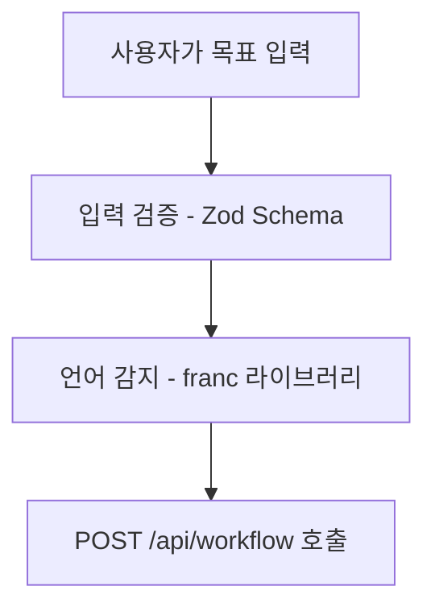
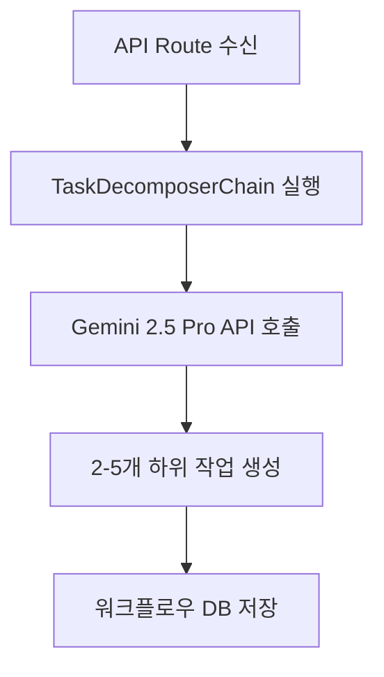
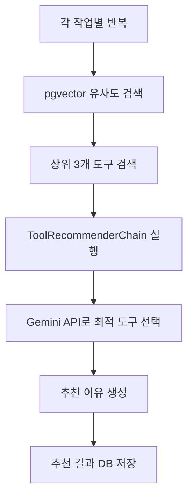
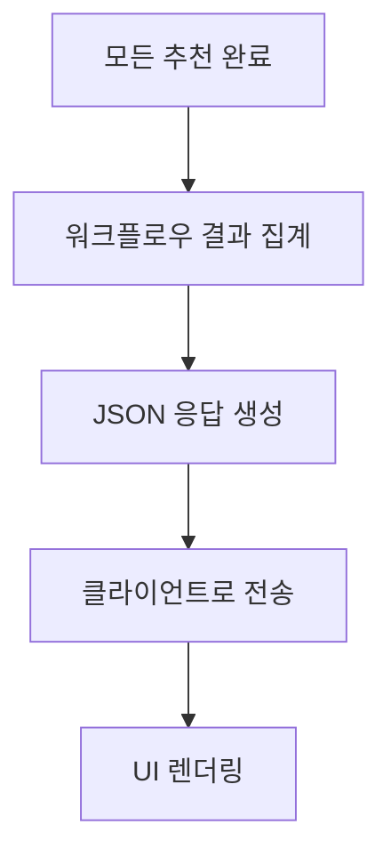
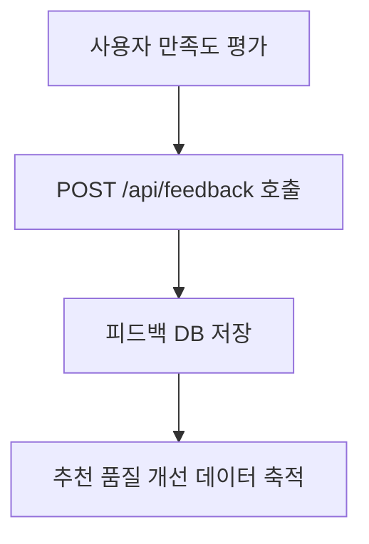
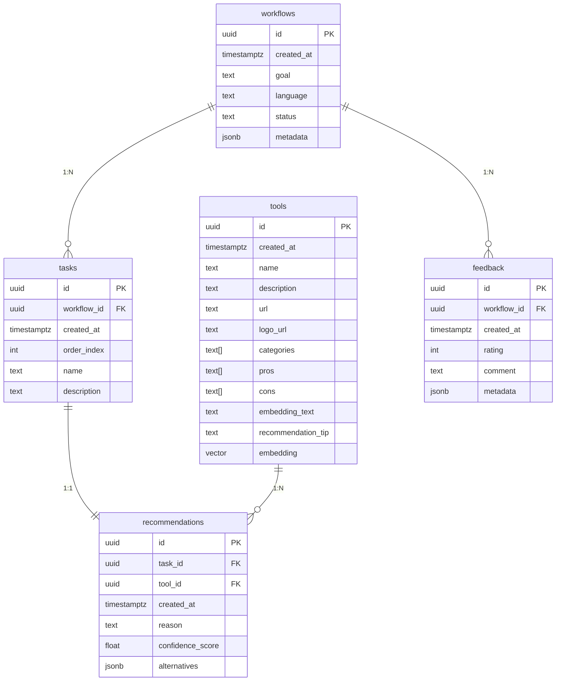

# AI 워크플로우 추천 시스템 - 데이터 플로우 & ERD

## 1. 시스템 개요

### 1.1. 비즈니스 플로우

```
사용자 목표 입력 → 언어 감지 → 작업 분해 → 도구 추천 → 결과 표시 → 만족도 피드백
```

### 1.2. 기술 스택

- **Frontend**: Next.js 15 + React + TypeScript
- **Backend**: Next.js API Routes
- **Database**: Supabase (PostgreSQL + pgvector)
- **AI/ML**: Google AI (Gemini 2.5 Pro) + LangChain.js
- **State Management**: TanStack Query + Zustand

## 2. 상세 데이터 플로우

### 2.1. 사용자 입력 단계



**데이터 구조:**

```typescript
interface UserGoalInput {
  goal: string; // 10-200자 사이
  language: string; // 'ko', 'en' 등
  timestamp: Date;
}
```

### 2.2. 작업 분해 단계



**데이터 구조:**

```typescript
interface TaskDecomposition {
  workflowId: string;
  tasks: {
    order: number;
    name: string;
    description: string;
  }[];
}
```

### 2.3. 도구 추천 단계



**데이터 구조:**

```typescript
interface ToolRecommendation {
  taskId: string;
  toolId: string;
  reason: string;
  confidence: number;
  alternatives?: string[];
}
```

### 2.4. 결과 반환 단계



### 2.5. 피드백 수집 단계



## 3. 데이터베이스 스키마

### 3.1. 전체 ERD



### 3.2. 테이블별 상세 스키마

#### 3.2.1. workflows 테이블

```sql
CREATE TABLE workflows (
    id UUID PRIMARY KEY DEFAULT gen_random_uuid(),
    created_at TIMESTAMPTZ DEFAULT now(),
    goal TEXT NOT NULL CHECK (length(goal) >= 10 AND length(goal) <= 200),
    language TEXT NOT NULL DEFAULT 'ko',
    status TEXT NOT NULL DEFAULT 'processing' CHECK (status IN ('processing', 'completed', 'failed')),
    metadata JSONB DEFAULT '{}' -- 추가 분석 데이터 저장용
);

-- 인덱스
CREATE INDEX idx_workflows_created_at ON workflows(created_at DESC);
CREATE INDEX idx_workflows_language ON workflows(language);
CREATE INDEX idx_workflows_status ON workflows(status);
```

#### 3.2.2. tasks 테이블

```sql
CREATE TABLE tasks (
    id UUID PRIMARY KEY DEFAULT gen_random_uuid(),
    workflow_id UUID NOT NULL REFERENCES workflows(id) ON DELETE CASCADE,
    created_at TIMESTAMPTZ DEFAULT now(),
    order_index INTEGER NOT NULL CHECK (order_index >= 1 AND order_index <= 5),
    name TEXT NOT NULL,
    description TEXT,

    UNIQUE(workflow_id, order_index) -- 같은 워크플로우 내에서 순서 중복 방지
);

-- 인덱스
CREATE INDEX idx_tasks_workflow_id ON tasks(workflow_id);
CREATE INDEX idx_tasks_order ON tasks(workflow_id, order_index);
```

#### 3.2.3. tools 테이블 (TRD 기반 확장)

```sql
-- pgvector 익스텐션 활성화
CREATE EXTENSION IF NOT EXISTS vector;

CREATE TABLE tools (
    id UUID PRIMARY KEY DEFAULT gen_random_uuid(),
    created_at TIMESTAMPTZ DEFAULT now(),
    updated_at TIMESTAMPTZ DEFAULT now(),
    name TEXT NOT NULL UNIQUE,
    description TEXT,
    url TEXT,
    logo_url TEXT,
    categories TEXT[] DEFAULT '{}',
    pros TEXT[] DEFAULT '{}',
    cons TEXT[] DEFAULT '{}',
    embedding_text TEXT, -- RAG 검색용 텍스트
    recommendation_tip TEXT, -- LLM 추천 이유 생성 팁
    embedding VECTOR(768), -- Google text-embedding-004 모델
    is_active BOOLEAN DEFAULT true -- 도구 활성화 상태
);

-- 인덱스
CREATE INDEX idx_tools_name ON tools(name);
CREATE INDEX idx_tools_categories ON tools USING GIN(categories);
CREATE INDEX idx_tools_active ON tools(is_active) WHERE is_active = true;
CREATE INDEX idx_tools_embedding ON tools USING ivfflat (embedding vector_cosine_ops) WITH (lists = 100);

-- 업데이트 시간 자동 갱신 트리거
CREATE OR REPLACE FUNCTION update_updated_at_column()
RETURNS TRIGGER AS $$
BEGIN
    NEW.updated_at = now();
    RETURN NEW;
END;
$$ language 'plpgsql';

CREATE TRIGGER update_tools_updated_at BEFORE UPDATE ON tools
    FOR EACH ROW EXECUTE FUNCTION update_updated_at_column();
```

#### 3.2.4. recommendations 테이블

```sql
CREATE TABLE recommendations (
    id UUID PRIMARY KEY DEFAULT gen_random_uuid(),
    task_id UUID NOT NULL REFERENCES tasks(id) ON DELETE CASCADE,
    tool_id UUID REFERENCES tools(id) ON DELETE SET NULL,
    created_at TIMESTAMPTZ DEFAULT now(),
    reason TEXT NOT NULL, -- 추천 이유
    confidence_score FLOAT CHECK (confidence_score >= 0 AND confidence_score <= 1),
    alternatives JSONB DEFAULT '[]', -- 대안 도구들 정보

    UNIQUE(task_id) -- 하나의 작업당 하나의 추천만
);

-- 인덱스
CREATE INDEX idx_recommendations_task_id ON recommendations(task_id);
CREATE INDEX idx_recommendations_tool_id ON recommendations(tool_id);
CREATE INDEX idx_recommendations_confidence ON recommendations(confidence_score DESC);
```

#### 3.2.5. feedback 테이블

```sql
CREATE TABLE feedback (
    id UUID PRIMARY KEY DEFAULT gen_random_uuid(),
    workflow_id UUID NOT NULL REFERENCES workflows(id) ON DELETE CASCADE,
    created_at TIMESTAMPTZ DEFAULT now(),
    rating INTEGER NOT NULL CHECK (rating >= 1 AND rating <= 5),
    comment TEXT,
    metadata JSONB DEFAULT '{}', -- 추가 피드백 데이터

    UNIQUE(workflow_id) -- 워크플로우당 하나의 피드백만
);

-- 인덱스
CREATE INDEX idx_feedback_workflow_id ON feedback(workflow_id);
CREATE INDEX idx_feedback_rating ON feedback(rating);
CREATE INDEX idx_feedback_created_at ON feedback(created_at DESC);
```

### 3.3. 트리거 함수들

#### 3.3.1. 임베딩 자동 생성 트리거

```sql
-- 임베딩 생성 함수 (Supabase Edge Function에서 구현)
CREATE OR REPLACE FUNCTION generate_embedding_for_tool()
RETURNS TRIGGER AS $$
DECLARE
    embedding_result VECTOR(768);
BEGIN
    -- embedding_text가 변경되었을 때만 실행
    IF TG_OP = 'INSERT' OR (TG_OP = 'UPDATE' AND OLD.embedding_text IS DISTINCT FROM NEW.embedding_text) THEN
        -- Edge Function 호출하여 임베딩 생성
        -- 실제 구현은 Edge Function에서 수행
        NEW.embedding = NULL; -- 일단 NULL로 설정, Edge Function에서 업데이트
    END IF;

    RETURN NEW;
END;
$$ LANGUAGE plpgsql;

CREATE TRIGGER trigger_generate_embedding
    BEFORE INSERT OR UPDATE ON tools
    FOR EACH ROW
    EXECUTE FUNCTION generate_embedding_for_tool();
```

#### 3.3.2. 워크플로우 완료 상태 업데이트 트리거

```sql
CREATE OR REPLACE FUNCTION update_workflow_status()
RETURNS TRIGGER AS $$
DECLARE
    total_tasks INTEGER;
    completed_recommendations INTEGER;
BEGIN
    -- 해당 워크플로우의 총 작업 수 계산
    SELECT COUNT(*) INTO total_tasks
    FROM tasks
    WHERE workflow_id = COALESCE(NEW.task_id, OLD.task_id);

    -- 완료된 추천 수 계산
    SELECT COUNT(*) INTO completed_recommendations
    FROM recommendations r
    JOIN tasks t ON r.task_id = t.id
    WHERE t.workflow_id = COALESCE(
        (SELECT workflow_id FROM tasks WHERE id = NEW.task_id),
        (SELECT workflow_id FROM tasks WHERE id = OLD.task_id)
    );

    -- 모든 작업에 대한 추천이 완료되면 워크플로우 상태를 'completed'로 변경
    IF total_tasks = completed_recommendations THEN
        UPDATE workflows
        SET status = 'completed'
        WHERE id = (
            SELECT workflow_id FROM tasks
            WHERE id = COALESCE(NEW.task_id, OLD.task_id)
        );
    END IF;

    RETURN COALESCE(NEW, OLD);
END;
$$ LANGUAGE plpgsql;

CREATE TRIGGER trigger_update_workflow_status
    AFTER INSERT OR DELETE ON recommendations
    FOR EACH ROW
    EXECUTE FUNCTION update_workflow_status();
```

### 3.4. Row Level Security (RLS) 정책

#### 3.4.1. 기본 RLS 활성화

```sql
-- 모든 테이블에 RLS 활성화
ALTER TABLE workflows ENABLE ROW LEVEL SECURITY;
ALTER TABLE tasks ENABLE ROW LEVEL SECURITY;
ALTER TABLE tools ENABLE ROW LEVEL SECURITY;
ALTER TABLE recommendations ENABLE ROW LEVEL SECURITY;
ALTER TABLE feedback ENABLE ROW LEVEL SECURITY;
```

#### 3.4.2. 공개 읽기 정책 (MVP용)

```sql
-- MVP에서는 모든 사용자가 읽기 가능
CREATE POLICY "Public read access" ON workflows FOR SELECT USING (true);
CREATE POLICY "Public read access" ON tasks FOR SELECT USING (true);
CREATE POLICY "Public read access" ON tools FOR SELECT USING (true);
CREATE POLICY "Public read access" ON recommendations FOR SELECT USING (true);

-- 삽입은 서비스 역할만 가능
CREATE POLICY "Service role insert" ON workflows FOR INSERT WITH CHECK (auth.role() = 'service_role');
CREATE POLICY "Service role insert" ON tasks FOR INSERT WITH CHECK (auth.role() = 'service_role');
CREATE POLICY "Service role insert" ON recommendations FOR INSERT WITH CHECK (auth.role() = 'service_role');
CREATE POLICY "Service role insert" ON feedback FOR INSERT WITH CHECK (auth.role() = 'service_role');

-- tools 테이블은 관리자만 수정 가능
CREATE POLICY "Admin only modify" ON tools FOR ALL USING (auth.role() = 'service_role');
```

## 4. API 스키마

### 4.1. POST /api/workflow

```typescript
// 요청
interface WorkflowRequest {
  goal: string; // 10-200자
  language: string; // 'ko', 'en' 등
}

// 응답
interface WorkflowResponse {
  workflowId: string;
  tasks: {
    id: string;
    name: string;
    order: number;
    recommendedTool: {
      id: string;
      name: string;
      logoUrl: string;
      url: string;
    } | null;
    recommendationReason: string;
    confidence: number;
  }[];
  status: "completed" | "processing" | "failed";
}
```

### 4.2. POST /api/feedback

```typescript
// 요청
interface FeedbackRequest {
  workflowId: string;
  rating: number; // 1-5
  comment?: string;
}

// 응답
interface FeedbackResponse {
  success: boolean;
  message: string;
}
```

### 4.3. GET /api/tools

```typescript
// 응답
interface ToolsResponse {
  tools: {
    id: string;
    name: string;
    description: string;
    url: string;
    logoUrl: string;
    categories: string[];
    pros: string[];
    cons: string[];
  }[];
}
```

## 5. 성능 최적화 전략

### 5.1. 데이터베이스 최적화

- **인덱스 전략**: 자주 조회되는 컬럼에 적절한 인덱스 생성
- **파티셔닝**: 시간 기반 파티셔닝으로 대용량 데이터 처리
- **커넥션 풀링**: Supabase 내장 커넥션 풀링 활용

### 5.2. 캐싱 전략

- **도구 정보**: Redis 또는 메모리 캐시로 도구 정보 캐싱
- **임베딩 벡터**: 자주 사용되는 임베딩 벡터 캐싱
- **API 응답**: 동일한 목표에 대한 캐싱 (선택적)

### 5.3. 벡터 검색 최적화

- **인덱스 튜닝**: ivfflat 인덱스의 lists 파라미터 조정
- **배치 처리**: 여러 작업의 벡터 검색을 배치로 처리
- **임베딩 품질**: 고품질 embedding_text 작성으로 검색 정확도 향상

## 6. 확장성 고려사항

### 6.1. 스케일링 준비

- **읽기 복제본**: 읽기 전용 쿼리를 위한 복제본 활용
- **샤딩**: 사용자 수 증가에 대비한 샤딩 전략
- **마이크로서비스**: 추후 도구 추천 엔진을 별도 서비스로 분리

### 6.2. 모니터링 & 분석

- **성능 메트릭**: API 응답 시간, 추천 정확도 추적
- **사용자 행동**: 워크플로우 생성 패턴, 만족도 분석
- **에러 추적**: 실패한 추천에 대한 상세 로깅

## 7. 보안 고려사항

### 7.1. 데이터 보호

- **개인정보**: 사용자 목표 텍스트의 암호화 저장 고려
- **API 키**: 환경 변수를 통한 안전한 API 키 관리
- **율제한**: API 엔드포인트의 rate limiting

### 7.2. 접근 제어

- **RLS 정책**: 세밀한 행 수준 보안 정책
- **서비스 계정**: 백엔드 작업용 전용 서비스 계정
- **CORS 설정**: 적절한 CORS 정책 설정
