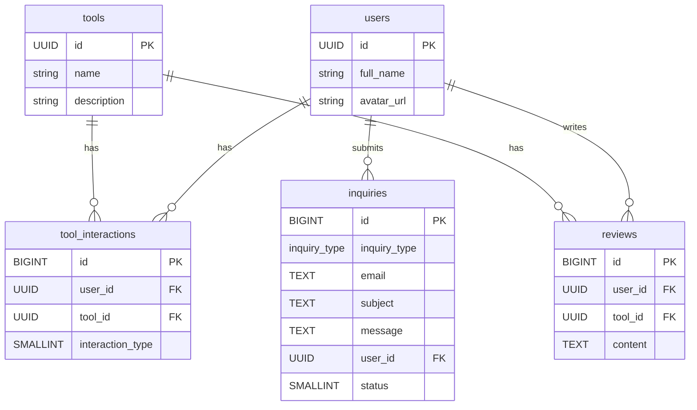

### **1. 데이터베이스 스키마 수정 및 ERD**

### **1.1. 추가될 테이블 정의**

**1. `inquiries` 테이블 (신규)**

- 사용자의 일반 문의, 버그 리포트, 서비스 제안 및 파트너의 제품 등록 요청을 모두 저장하는 통합 테이블입니다. `inquiry_type`으로 연락의 종류를 구분합니다.
    
    ```sql
    -- 문의 유형을 위한 ENUM 타입 생성
    CREATE TYPE inquiry_type AS ENUM (
        'general_question', -- 일반 문의
        'bug_report',       -- 버그 제보
        'feature_suggestion',-- 기능 제안
        'partnership_request' -- 파트너십/제품 등록 요청
    );
    
    -- inquiries 테이블: 모든 종류의 연락/문의 저장
    CREATE TABLE inquiries (
        id BIGINT PRIMARY KEY GENERATED ALWAYS AS IDENTITY,
        inquiry_type inquiry_type NOT NULL, -- 문의 유형
        email TEXT NOT NULL CHECK (email ~* '^[A-Za-z0-9._+%-]+@[A-Za-z0-9.-]+[.][A-Za-z]+$'), -- 이메일 형식 검증
        subject TEXT NOT NULL CHECK (char_length(subject) > 5), -- 제목 (최소 글자 수)
        message TEXT NOT NULL CHECK (char_length(message) > 10), -- 본문 (최소 글자 수)
        user_id UUID REFERENCES users(id) ON DELETE SET NULL, -- 문의를 보낸 사용자 (로그인 상태였다면 기록, 아니면 NULL)
        status SMALLINT DEFAULT 0, -- 처리 상태 (0: 접수, 1: 확인 중, 2: 처리 완료)
        created_at TIMESTAMPTZ DEFAULT now()
    );
    
    -- RLS 설정: 누구나 문의를 제출할 수 있도록 설정
    ALTER TABLE inquiries ENABLE ROW LEVEL SECURITY;
    CREATE POLICY "Inquiries can be created by anyone." ON inquiries FOR INSERT WITH CHECK (true);
    
    -- 관리자만 모든 문의를 읽고 수정할 수 있도록 하는 정책 (향후 관리자 역할을 위해)
    -- CREATE POLICY "Admins can manage all inquiries." ON inquiries
    --     FOR ALL USING (is_admin(auth.uid())); -- is_admin()은 별도 정의 필요한 함수
    
    ```
    

### **1.2. ERD (Entity-Relationship Diagram) - 업데이트**

기존 ERD에 `inquiries` 테이블을 추가합니다.



- **관계 설명:**
    - *사용자(`users`)**와 **문의(`inquiries`)**는 **선택적(Optional) 1:N 관계**입니다.
    - 로그인한 사용자가 문의를 남기면 `user_id`가 기록됩니다.
    - 비로그인 사용자(게스트)도 이메일만 입력하면 문의를 남길 수 있으므로, 이 경우 `user_id`는 `NULL`이 됩니다.

---

### **2. TRD(기술 요구사항 명세서) 업데이트 (v1.2)**

Contact 페이지 기능 추가에 따른 기술적 변경 사항을 TRD에 반영합니다.

**(v1.1에서 변경/추가된 부분만 요약)**

- **3. API 엔드포인트 명세 (신규 추가):**
    - `POST /api/contact`:
        - **설명:** Contact 페이지 폼에서 제출된 내용을 `inquiries` 테이블에 저장한다.
        - **접근 제어:** **게스트, 로그인 사용자 모두 사용 가능.**
        - **요청 본문 (Request Body):**
            
            ```tsx
            // Zod 스키마
            import { z } from 'zod';
            
            export const contactFormSchema = z.object({
              inquiry_type: z.enum([
                'general_question',
                'bug_report',
                'feature_suggestion',
                'partnership_request',
              ]),
              email: z.string().email('유효한 이메일 주소를 입력해주세요.'),
              subject: z.string().min(5, '제목은 5자 이상 입력해주세요.'),
              message: z.string().min(10, '내용은 10자 이상 입력해주세요.'),
            });
            
            ```
            
        - **로직:**
            1. Zod 스키마로 요청 본문을 검증한다.
            2. 요청 헤더에서 Supabase 인증 토큰을 확인하여, 로그인된 사용자라면 `user_id`를 가져온다. (게스트라면 `null`)
            3. 요청 본문 데이터와 `user_id`를 `inquiries` 테이블에 INSERT한다.
            4. 성공 시 `201 Created` 응답을 반환한다.
- **5. 프론트엔드 구현 계획:**
    - **5.1. 페이지 및 컴포넌트 구조 (추가):**
        - `contact/page.tsx`: Contact 페이지의 전체 레이아웃.
        - `ContactForm.tsx`: 문의 유형 선택(`Select`), 이메일(`Input`), 제목(`Input`), 내용(`Textarea`) 필드와 제출(`Button`)로 구성된 폼 컴포넌트.
            - **사용자 경험:** 만약 사용자가 로그인 상태라면, `email` 필드는 자동으로 채워주고 읽기 전용으로 만들 수 있다.
            - `react-hook-form`과 `zod`를 연동하여 클라이언트 사이드 유효성 검사를 수행한다.
            - TanStack Query의 `useMutation`을 사용하여 `POST /api/contact` API를 호출한다.
            - 폼 제출 성공 시 "문의가 성공적으로 접수되었습니다."와 같은 토스트 메시지(`shadcn/ui`의 `Toast`)를 보여준다.

